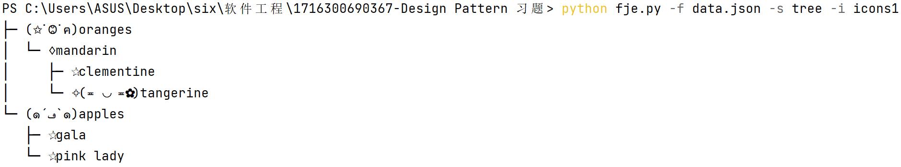
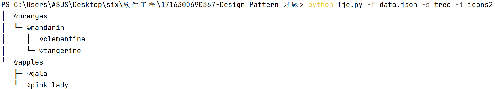
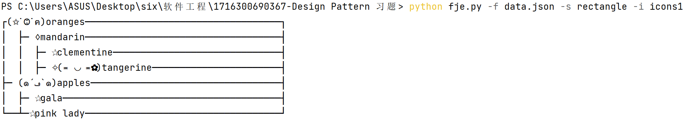
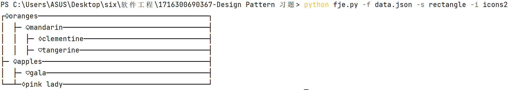

###类图
```
+-------------------+
|   Node            |
+-------------------+
| - name: str       |
| - children: list  |
+-------------------+
| + __init__(name, children) |
| + __str__()       |
+-------------------+

+-------------------+
|   NodeBuilder     |
+-------------------+
| - name: str       |
| - children: list  |
+-------------------+
| + __init__(name)  |
| + add_child(child)|
| + build()         |
+-------------------+

+-------------------+
|   IconFamilyFactory|
+-------------------+
| + create_icon_family() |
+-------------------+

+-------------------+
|   StyleFactory    |
+-------------------+
| + draw(node, prefix, is_last) |
+-------------------+
            ^
            |
+-------------------+  +-------------------+
| TreeStyleFactory  |  | RectangleStyleFactory |
+-------------------+  +-------------------+
| - icon_family: dict |  | - icon_family: dict   |
| + __init__(icon_family) |
| + draw(node, prefix, is_last) |
+-------------------+  +-------------------+
                               | - flag: int           |
                               | + draw(node, prefix, is_last1, is_last2) |
+-------------------+
|   FunnyJsonExplorer|
+-------------------+
| - json_file: str  |
| - style_factory: StyleFactory |
| - root: Node      |
+-------------------+
| + __init__(json_file, style_factory) |
| + _load()         |
| + _parse(data, name) |
| + show()          |
+-------------------+

+-------------------+
|   main            |
+-------------------+
| - icon_factory_class: IconFamilyFactory |
| - style_factory_class: StyleFactory |
+-------------------+
| + main()          |
+-------------------+
```
###说明
####Node 类:
表示树中的一个节点。<br>
***name***：节点的名称。<br>
***children***：子节点的列表。<br>
####NodeBuilder 类:

用于构建 Node 对象。<br>
***name***：节点的名称。<br>
***children***：子节点的列表。<br>
***add_child(child)***：添加子节点。<br>
***build()***：构建并返回一个 Node 对象。<br>
####IconFamilyFactory 类:

抽象工厂类，用于创建图标家族。<br>
***_load_icon_families()***: 读取icon配置文件
***create_icon_family()***：返回特定图标家族的字典。<br>
####StyleFactory 类:

抽象工厂类，用于绘制节点。<br>
***draw(node, prefix, is_last)***：抽象方法，用于绘制节点。<br>
####TreeStyleFactory 和 RectangleStyleFactory 类:

实现 StyleFactory，分别以树状和矩形方式绘制节点。<br>
***icon_family***：图标家族的字典。<br>
***draw(node, prefix, is_last)***：绘制节点的具体实现。<br>
####FunnyJsonExplorer 类:

主类，用于加载和展示JSON数据。<br>
***json_file***：JSON文件的路径。<br>
***style_factory***：样式工厂对象，用于绘制节点。<br>
***root***：根节点。<br>
***_load()***：加载JSON数据。<br>
***_parse(data, name)***：解析JSON数据并创建节点。<br>
***show()***：展示节点。<br>
####main 函数:

解析命令行参数，根据参数选择适当的图标工厂和样式工厂。<br>
创建 FunnyJsonExplorer 对象并展示数据。<br>
###设计模式及作用
####1. 工厂方法（Factory Method）
相关类： TreeStyleFactory 和 RectangleStyleFactory

说明：<br>
工厂方法模式定义了一个创建对象的接口，但由子类决定要实例化的类是哪一个。它使一个类的实例化延迟到其子类。
在你的代码中，StyleFactory类定义了创建图标家族的方法 draw()，具体的工厂 TreeStyleFactory 和 RectangleStyleFactory 实现了这个方法，返回不同的图标家族。
####2. 抽象工厂（Abstract Factory）
相关类： StyleFactory、TreeStyleFactory、RectangleStyleFactory

说明：<br>
抽象工厂模式提供一个创建一系列相关或相互依赖对象的接口，而无需指定它们具体的类。
StyleFactory 是一个抽象工厂，用于创建绘图样式。具体的 TreeStyleFactory 和 RectangleStyleFactory 实现了 StyleFactory，返回不同的绘图样式。
####3. 建造者（Builder）
相关类： NodeBuilder

说明：<br>
建造者模式将一个复杂对象的构建过程与其表示分离，使得同样的构建过程可以创建不同的表示。
在你的代码中，NodeBuilder 类用于构建 Node 对象。通过调用 add_child 方法添加子节点，然后调用 build 方法创建节点对象。
####4. 组合模式（Composite）
相关类： Node

说明：<br>
组合模式允许你将对象组合成树形结构来表示“部分-整体”的层次结构。组合能让客户以一致的方式处理个别对象以及对象组合。
在你的代码中，Node 类表示树中的一个节点，可以包含多个子节点。这体现了部分和整体的层次结构。
###要求
####1. （必做）：不改变现有代码，只需添加新的抽象工厂，即可添加新的风格
StyleFactory 是抽象工厂，用于创建绘图样式。具体的 TreeStyleFactory 和 RectangleStyleFactory 实现了 StyleFactory，返回不同的绘图样式。
可以编写新的具体风格，进行风格扩展。

####2. （选做）：通过配置文件，可添加新的图标族
通过读取icon.json来配置icons_family,在icon.json里面添加新的icons，就可以在代码中添加新的图标族。
###实验结果




###源代码库：公开可访问的Github repo URL
https://github.com/zzz589/software_pro/tree/main/homework
